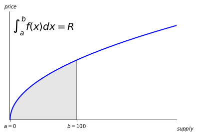
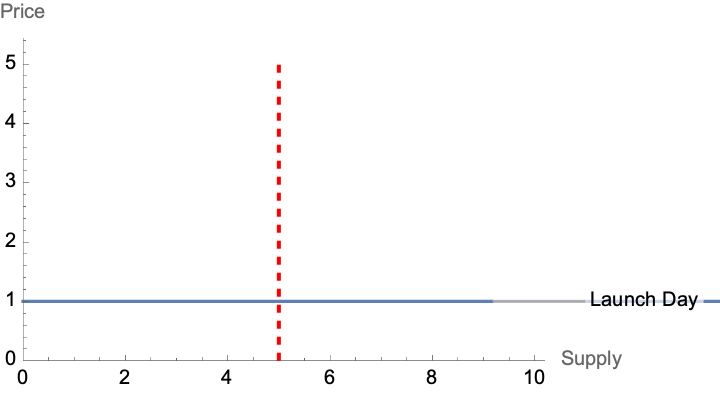

# Fair Launch

A bonding curve makes it profitable to get in early, particularly one shaped like this:

While this is a desired characteristic of bonding curves, it is also extremely vulnerable to bots. If getting in early means a guarenteed profit, there is a lottery on getting your transaction through first. If there is a lottery on getting your transaction through first, a bot will send 10,000 transactions.

So how do we disincentivise bots?

## The Bonding Curve Fair Launch

The goal is to disencentivize bots while still retaining the property that getting into the bonding curve early is ideal. The way we do this is with a gradually steepening bonding curve.

At launch, the bonding curve looks like this. Let's draw a line to say that there are 5 tokens purchased at launch day:

After one day, the curve starts to steepen:

Notice that the area under the curve at 5 is the same. The token just increased in price according to the curve, but there are still the same amount of `Reserve` tokens.

In the first day, the bots had no advantage in getting their transactions through sooner, as they received the same price as everyone else. On the second day, all day one participants gain an edge on future market entrants.

Over time, the curve steepens to its final shape:

## Changing Bonding Curves

The above took advantage of a powerful characteristic of Strata Bonding Curves: they do not determine price only from `Supply`. The current price is a function of both `Supply` and `Reserve`. This means that the underlying shape of the curve can change so long as the area under the new curve matches the area under the old curve. More on this in [Advanced Bonding Curves](./advanced_bonding_curves)